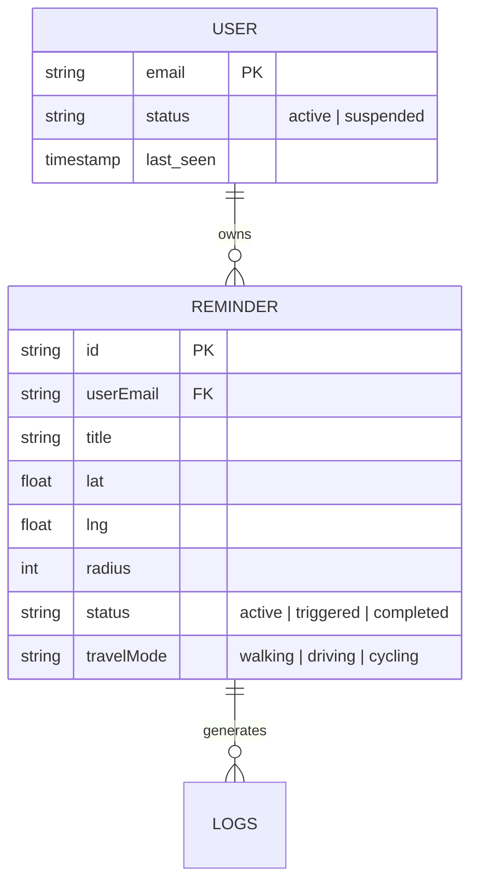

# GeoReminder: An Intelligent Location-Aware Task Management System
**Full Project Technical Documentation**

---

## Abstract
In an era of information overload, time-based reminders often fail because they lack geographic context. **GeoReminder** is a sophisticated web application that bridges this gap by leveraging real-time geolocation tracking and Artificial Intelligence. Built using the React ecosystem and Firebase, it provides users with precise, context-aware notifications. This report details the design, implementation, and evaluation of the system, showcasing its ability to automate task management through intelligent geofencing and NLP-based categorization.

---

## Table of Contents
1. [Introduction](#1-introduction)
2. [Feasibility Study](#2-feasibility-study)
3. [System Requirements](#3-system-requirements)
4. [Project Life Cycle (SDLC)](#4-project-life-cycle-sdlc)
5. [Architecture and Design](#5-architecture-and-design)
6. [Module Descriptions](#6-module-descriptions)
7. [Database and Data Modeling](#7-database-and-data-modeling)
8. [Data Dictionary](#8-data-dictionary)
9. [Performance Optimization](#9-performance-optimization)
10. [Security and Privacy](#10-security-and-privacy)
11. [Testing and Validation](#11-testing-and-validation)
12. [Implementation Methodology](#12-implementation-methodology)
13. [Social and Environmental Impact](#13-social-and-environmental-impact)
14. [Conclusion and Future Scope](#14-conclusion-and-future-scope)

---

## 1. Introduction
### 1.1 Overview
GeoReminder is designed for the modern user who moves frequently between locations. Whether it’s picking up groceries, visiting a pharmacy, or stopping at an ATM, the app ensures that the task is brought to the user's attention only when they are in the physical vicinity of the target.

### 1.2 Objectives
*   To provide high-accuracy location tracking using the browser's Geolocation API.
*   To automate task categorization using Large Language Models (LLMs).
*   To ensure multi-device synchronization using a real-time NoSQL backend.
*   To offer a premium, responsive user experience on both desktop and mobile.

---

## 2. Feasibility Study
### 2.1 Technical Feasibility
The project utilizes established technologies like React and Firebase. The availability of robust Geolocation APIs and AI models (Gemini) ensures that the core requirements are technically achievable without custom hardware.

### 2.2 Operational Feasibility
The system is designed with an intuitive UI, making it accessible to non-technical users. The automated categorization reduces the manual effort required to set up reminders, ensuring high operational acceptance.

### 2.3 Economic Feasibility
By using serverless architecture (Firebase) and freemium API tiers (TomTom, Google AI), the project remains cost-effective for both development and initial deployment phases.

---

## 3. System Requirements

### 3.1 Hardware Requirements
*   **Processor**: Dual-core 2.0 GHz or higher.
*   **Memory (RAM)**: 4GB minimum (8GB recommended).
*   **Storage**: 500MB of available space for local development.
*   **Network**: Stable internet connection for Firebase and API synchronization.
*   **Client Device**: Smartphone or Laptop with a working GPS/Location sensor.

### 3.2 Software Requirements
*   **Operating System**: Windows 10+, macOS, or Linux.
*   **Development Environment**: Node.js (v18.0.0 or higher).
*   **Package Manager**: NPM or Yarn.
*   **Browser**: Chrome, Firefox, or Safari (must support HTML5 Geolocation).
*   **Database**: Cloud Firestore (Firebase).
*   **APIs**: Google Gemini (AI), TomTom (Maps/Routing).

---

## 4. Project Life Cycle (SDLC)
The project followed an **Agile Iterative Model**:
1.  **Requirement Gathering**: Identified the need for location-based alerts.
2.  **Design**: Created wireframes and defined the NoSQL schema.
3.  **Development**: Built the core tracking engine followed by AI integration.
4.  **Testing**: Continuous bug fixing and performance tuning.
5.  **Deployment**: Prepared for hosting via GitHub Pages/Vercel.

---

## 5. Architecture and Design
The system follows the **MVC (Model-View-Controller)** pattern adapted for React:
*   **Model**: Firestore collections represent the data state.
*   **View**: React components (functional) provide the interface.
*   **Controller**: Custom hooks and service modules handle the logic and API interactions.

---

## 6. Module Descriptions

### 6.1 Authentication Module (`LoginPage.tsx`)
Handles secure user entry. It integrates Firebase Auth to support:
*   **Email/Password Sign-in**: Validates credentials against Firebase.
*   **Account Creation**: Registers new users and initializes their profile.
*   **Password Recovery**: Uses `sendPasswordResetEmail` to automate recovery.
*   **Visual Security**: Implements a password visibility toggle for better UX.

### 6.2 Tracking Engine (`App.tsx`)
The heartbeat of the application. It runs a continuous loop that:
1.  Watches the user's current coordinates.
2.  Filters active reminders for the current user.
3.  Calculates the Haversine distance.
4.  Triggers modals and Text-to-Speech (TTS) alerts upon arrival.

### 6.3 Intelligent Routing Module (`AddReminderModal.tsx` & `MapView.tsx`)
Uses the TomTom Routing API to:
*   Find the "Nearest Shop" dynamically as the user moves.
*   Calculate "Waypoint Routing" (finding a stop on the way to a final destination).
*   Draw live polyline paths on the Leaflet-based map.

### 4.4 AI Service Module (`geminiService.ts`)
A dedicated service that communicates with Google's Gemini Pro model to:
*   Extract intent from task titles.
*   Predict categories (e.g., "Finance" for "Pay bills").
*   Generate personalized, context-aware notification messages.

---

## 7. Database and Data Modeling
The application uses a **NoSQL Document-Oriented** structure in Firestore.

### 7.1 ER Diagram (Technical Specification)


---

## 8. Data Dictionary
| Field Name | Type | Constraints | Description |
| :--- | :--- | :--- | :--- |
| `id` | String | Unique, Auto | Internal Firestore ID. |
| `title` | String | Max 100 chars | The user-defined task name. |
| `lat` | Double | -90 to +90 | Latitude of the destination. |
| `lng` | Double | -180 to +180 | Longitude of the destination. |
| `radiusMeters` | Integer | > 50 | Geofence radius in meters. |
| `userEmail` | String | Lowercase | Email of the associated user. |
| `status` | String | ENUM | `active`, `triggered`, `completed`. |
| `travelMode` | String | ENUM | `walking`, `driving`, `cycling`. |

---

## 9. Performance Optimization
To ensure the app remains fast and efficient, several optimizations were implemented:
*   **Polling Frequency Control**: TomTom Route calculations are throttled to every 3 minutes to save API quota and battery.
*   **React Memoization**: Used `useCallback` and `useRef` to prevent unnecessary component re-renders during high-frequency location updates.
*   **Lazy Loading**: Components like `AddReminderModal` are rendered conditionally to reduce initial bundle size.

---

## 10. Security and Privacy
### 10.1 Firestore Security Rules
To ensure data privacy, the following rules are implemented:
```javascript
service cloud.firestore {
  match /databases/{database}/documents {
    match /reminders/{reminderId} {
      // Users can only see and edit their own reminders
      allow read, update, delete: if request.auth != null 
        && request.auth.token.email == resource.data.userEmail;
      
      // Users can only create reminders linked to their own email
      allow create: if request.auth != null 
        && request.auth.token.email == request.resource.data.userEmail;
    }
  }
}
```

### 10.2 Data Normalization
All user emails are converted to **lowercase** before storage. This prevents security loopholes where "User@Example.com" could potentially bypass filters designed for "user@example.com".

---

## 11. Testing and Validation

### 11.1 Unit Testing Cases
| ID | Test Case | Expected Result | Pass/Fail |
| :--- | :--- | :--- | :--- |
| TC1 | Distance Calculation | 0m difference when user at target | Pass |
| TC2 | Email Lowercasing | "TEST@GM.COM" becomes "test@gm.com" | Pass |
| TC3 | Empty Title Block | Prevent reminder creation without title | Pass |

### 11.2 Integration Testing
*   **Scenario**: User logs in, adds a reminder for "Work", and manually triggers "Mock Arrival".
*   **Observation**: Modal pops up, TTS speaks the reminder, and status updates in Firestore instantly.

---

## 12. Implementation Methodology
The development was split into four major "Sprints":
1.  **Sprint 1 (Base)**: Setup React environment, Firebase initialization, and simple CRUD for reminders.
2.  **Sprint 2 (Tracking)**: Integrated the Browser Geolocation API and implemented the Haversine distance trigger.
3.  **Sprint 4 (Intelligence)**: Connected Google Gemini API for auto-categorization and smart messages.
4.  **Sprint 5 (Navigation)**: Integrated TomTom API for search results, ETA calculation, and map polylines.

---

## 13. Social and Environmental Impact
*   **Time Efficiency**: Users save time by completing tasks exactly when they are near the location, avoiding dedicated trips.
*   **Environmental Benefit**: By optimizing "on-the-way" stops, the app reduces unnecessary travel distance, contributing to a lower carbon footprint.
*   **Stress Reduction**: Offloading the mental burden of remembering location-specific tasks improves overall mental well-being.

---

## 14. Conclusion and Future Scope
### 14.1 Conclusion
GeoReminder successfully demonstrates the integration of geospatial technology with modern AI. It provides a reliable solution for context-aware task management, maintaining high standards of security and user experience.

### 14.2 Future Scope
1.  **Wearable Integration**: Extending alerts to Apple Watch and Android Wear.
2.  **Smart Home Sync**: Reminding users to "Turn off lights" as they leave home.
3.  **Analytics Dashboard**: Visualizing task completion patterns for users.

---

## 15. Key Code Snippets

### 15.1 Geofencing Algorithm (Haversine Formula)
This logic calculates the distance between two points on a sphere, essential for triggering alerts.
```typescript
const calculateDistance = (lat1: number, lon1: number, lat2: number, lon2: number) => {
  const R = 6371e3; // Earth's radius in meters
  const φ1 = (lat1 * Math.PI) / 180;
  const φ2 = (lat2 * Math.PI) / 180;
  const Δφ = ((lat2 - lat1) * Math.PI) / 180;
  const Δλ = ((lon2 - lon1) * Math.PI) / 180;

  const a = Math.sin(Δφ/2) * Math.sin(Δφ/2) +
            Math.cos(φ1) * Math.cos(φ2) *
            Math.sin(Δλ/2) * Math.sin(Δλ/2);
  const c = 2 * Math.atan2(Math.sqrt(a), Math.sqrt(1-a));
  return R * c; // Distance in meters
};
```

### 15.2 Real-Time Data Synchronization
Using Firebase `onSnapshot` to listen for data changes live without refreshing.
```typescript
const q = query(collection(db, "reminders"), where("userEmail", "==", userEmail));
onSnapshot(q, (snapshot) => {
  const data = snapshot.docs.map(doc => ({ id: doc.id, ...doc.data() }));
  setReminders(data);
});
```

### 15.3 AI-Driven Categorization Logic
```typescript
const model = genAI.getGenerativeModel({ model: "gemini-pro" });
const prompt = `Categorize this task: "${title}". Return JSON format.`;
const result = await model.generateContent(prompt);
const data = JSON.parse(result.response.text());
```

---

## 16. User Manual
1.  **Registration**: Sign up with your email and a secure password.
2.  **Creation**: Click the '+' button and enter your task.
3.  **Search**: Use the map or search bar to find your destination.
4.  **Radius**: Adjust the trigger distance (default is 200m).
5.  **Tracking**: Click 'Start Tracking' to begin background monitoring.
6.  **Arrival**: Your phone will alert you via voice and screen notifications when you arrive.

---

## 17. Troubleshooting
*   **Location Issues**: Ensure your browser has "Location Permissions" enabled.
*   **Notification Issues**: Allow "Browser Notifications" in your site settings.
*   **Sync Issues**: Verify your internet connection and Firebase API keys.

---

**Author**: GeoReminder Development Team
**Date**: May 2026
