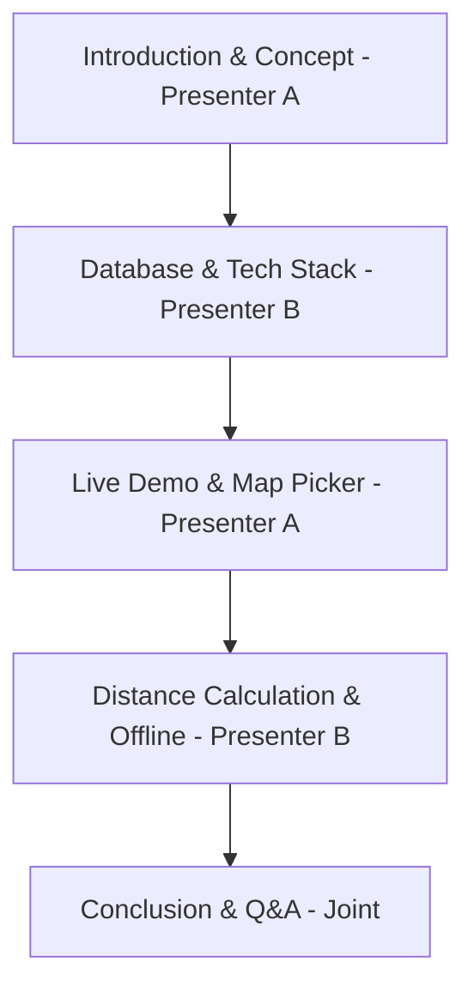

# GeoReminder: Project Review Presentation Guide (Simple English)

This guide helps you and your friend present the **GeoReminder** project. We have divided the work into two parts so it is easy to explain.

---

## 📅 Presentation Plan (10 Minutes Total)
* **Time:** 8 to 10 minutes for the presentation and demo, then a few minutes for questions.
* **The Team:**
  * **Presenter A (You):** Explains what the app does, how Gemini AI works, and shows the live demo.
  * **Presenter B (Your Friend):** Explains the database, the math for distance calculation, and offline features.

---

## 🧑‍🤝‍🧑 Presentation Flow

---

### 🧑‍💻 Presenter A (You): The Idea, AI, and Live Demo
*Your job is to explain **why** we built this app, how users use it, and show the live demo.*

#### 1. Introduction & The Problem (1.5 Minutes)
* **What to say:**
  > *"Most reminder apps remind us at a certain time, like 5:00 PM. But many tasks depend on **where** we are, not **when** we are. For example, 'buy milk when I am near the grocery store'. If you get a reminder at 5:00 PM but you are not near the store, it is not helpful. GeoReminder solves this. It reminds you when you physically enter the area of your task."*

#### 2. Gemini AI Integration (1.5 Minutes)
* **What to say:**
  > *"To make it very easy to add reminders, we used Gemini AI. Instead of filling out long forms, the user can just type a normal sentence. For example: 'Buy medicines from the pharmacy.' Gemini reads the text, understands it, automatically categorizes it under 'Health', picks a matching emoji ('🏥'), and selects a matching color theme. This makes the app very simple and fast to use."*

#### 3. Live Demo (3 Minutes)
* **What to show on screen:**
  1. **Login:** Log in securely. Show the user profile page.
  2. **Add Reminder:** Type a simple task. Use the search bar to find a place, or click directly on the map. Set a trigger distance (like 200 meters).
  3. **Map Screen:** Show the Leaflet map with custom markers and the circles that show the reminder boundaries.
  4. **Trigger Simulation:** Simulate entering the boundary. Show the pop-up modal that alerts the user and shows the fastest driving/walking route and ETA calculated by TomTom.

---

### 🧑‍💻 Presenter B (Your Friend): Code, Database, and Math
*Your friend's job is to explain **how the app is built**, where the data is stored, and the math behind it.*

#### 1. How the App is Built & Database (2 Minutes)
* **What to say:**
  > *"We built the app using React and TypeScript on the frontend. We use Google Firebase to log users in securely and store data in real-time. We use TomTom APIs to search for places and calculate driving routes. Finally, we use Leaflet to display the map on the screen."*
* **Explaining the diagrams:**
  * **DFD (Data Flow Diagram):** Shows how the user's text goes to Gemini AI for categorization, and how GPS coordinates go to TomTom to get routes.
  * **ER (Entity-Relationship) Diagram:** Shows our database tables (collections). We have a `users` table and a `reminders` table. Every reminder is linked to a user using their email address.

#### 2. How Distance is Calculated (Geofencing Math) (2 Minutes)
* **What to say:**
  > *"To check if the user has reached the target location, the app compares the user's live GPS coordinates with the reminder's location coordinates. We calculate this distance using the **Haversine Formula**."*
* **The Math:**
  $$d = 2r \arcsin\left(\sqrt{\sin^2\left(\frac{\Delta \phi}{2}\right) + \cos(\phi_1)\cos(\phi_2)\sin^2\left(\frac{\Delta \lambda}{2}\right)}\right)$$
  > *"This formula finds the shortest distance between two points on the curved surface of the Earth. If this calculated distance is less than the radius set by the user, the reminder is triggered immediately."*

#### 3. Offline Capabilities (PWA) (1 Minute)
* **What to say:**
  > *"We made this a Progressive Web App (PWA). This means users can install it on their Android, iPhone, or Desktop like a regular app. It also caches files so it opens instantly, even if there is no internet connection."*

---

## ❓ Simple Q&A Answers (Defending your Project)
*Common questions the reviewer might ask and how to answer them:*

### Q1: "Why did you use Firebase Firestore (NoSQL) instead of SQL (MySQL)?"
* **Answer:** 
  > *"First, Firestore updates the screen in real-time. When a reminder is added or triggered, the UI updates instantly without reloading. Second, storing maps and routes data (which are long lists of coordinate points) is much easier in a NoSQL format than in rigid SQL tables."*

### Q2: "Continuous GPS tracking drains a phone's battery. How do you save battery life?"
* **Answer:** 
  > *"We do not check the GPS on a rigid timer. We only calculate the distance when the phone's system detects that the user has physically moved. Also, once a route is calculated by TomTom, we save it locally in the browser so we do not call the API repeatedly."*

### Q3: "What happens if the user loses their internet connection?"
* **Answer:** 
  > *"Thanks to our PWA setup and Firebase Offline support, the app still works. If a user adds a reminder while offline, the app saves it in the browser's temporary memory. Once the internet connection is back, it automatically uploads everything to the cloud database."*

### Q4: "What if the search bar cannot find a specific location?"
* **Answer:** 
  > *"We have a fallback map picker. The user can simply click anywhere directly on the map. The app gets the exact coordinates of that point, finds the address using reverse-geocoding, and fills in the details. So, it always works."*

---

## 🏆 Checklist for the Review Day
- [ ] **Run the local server:** Start the app with `npm run dev` before the review starts.
- [ ] **Check internet connection:** Make sure your internet is working so maps and login load fine.
- [ ] **Clean the dashboard:** Delete old reminders so your screen looks clean and professional for the demo.
