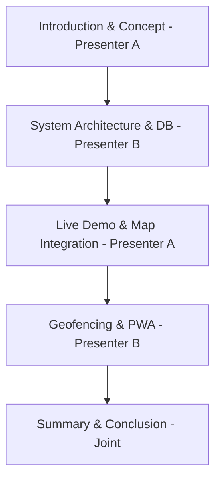

# GeoReminder: External Project Review Presentation Guide

This guide is designed to help you and your friend divide, structure, and confidently present the **GeoReminder** project to your external reviewer. 

---

## 📅 Presentation Strategy: The 10-Minute Pitch
Reviewers love structured, technical presentations that showcase **real-world utility**, **clean architecture**, and **technical depth**. 
* **Duration:** Aim for 8–10 minutes of presentation/demo, followed by Q&A.
* **Division:** 
  * **Presenter A (You):** The Visionary & Frontend lead (Core concept, UX/UI, Maps Integration, and Gemini AI context parsing).
  * **Presenter B (Your Friend):** The Architect & Systems lead (Database structure, Geofencing mathematical logic, PWA offline mechanics, and System Diagrams).

---

## 🧑‍🤝‍🧑 Role Division & Presentation Flow

---

### 🧑‍💻 Presenter A (You): Product Vision, AI, and Live Demo
*Your focus is on **why** the app was built, how the **user interacts** with it, the **NLP AI parser**, and showing the live demo.*

#### 1. Introduction & Problem Statement (1.5 Mins)
* **What to say:**
  > *"Traditional reminder apps are time-based (e.g., 'remind me at 5:00 PM'). However, human tasks are naturally location-based (e.g., 'buy milk when I am near the grocery store'). If you are not near the store at 5:00 PM, the reminder is useless. GeoReminder solves this by shifting the paradigm from **when** you are, to **where** you are."*
* **Core Value Prop:** Location-based geofences, natural language input parsed by AI, and intelligent real-time route calculation.

#### 2. AI Task Parsing (Gemini AI Integration) (1.5 Mins)
* **What to say:**
  > *"To make adding reminders seamless, we integrated Gemini AI. Instead of forcing users to fill out complex forms, they write a simple sentence like: 'Pick up medical reports from the clinic.' Gemini analyzes the text, automatically classifies the category as 'Health', pairs it with a matching emoji ('🏥'), and selects an aesthetically matching theme color. This reduces friction and makes the UX fluid."*

#### 3. Live Demonstration (3 Mins)
* **What to demonstrate:**
  1. **Login:** Log in securely using Google Auth (or the secure mock environment). Show how easy the signup/profile setup is.
  2. **Add Reminder:** Enter a natural language task. Use the map picker (powered by **TomTom Search & Leaflet Maps**) to search for a location or click directly on the map. Set a geofence radius (e.g., 200 meters).
  3. **Show Map UI:** Point out the beautifully custom-styled map markers, the active geofencing circles, and the responsive sidebar.
  4. **Trigger Simulation:** Simulate entering the geofence. Show the **Triggered Reminder Modal** with route details (driving/walking paths, total distance, and ETA calculated in real-time by TomTom).

---

### 🧑‍💻 Presenter B (Your Friend): System Architecture, DB, and Geofencing Mechanics
*Your friend's focus is on **how** the system is built, **data storage**, **mathematical coordinates**, and **performance/offline capability**.*

#### 1. System Architecture & Diagrams (2 Mins)
* **What to say:**
  > *"GeoReminder is built as a highly responsive single-page Progressive Web App (PWA) using React, TypeScript, and Vite. The backend leverages Google Firebase for Serverless Authentication and Cloud Firestore as a real-time NoSQL database. We integrate with TomTom APIs for spatial search/routing and Leaflet for visual rendering."*
* **Referencing Diagrams:** 
  * Show the **DFD (Data Flow Diagram)** to explain how user input flows from the UI to Gemini AI and TomTom, and how coordinates sync back.
  * Show the **ER (Entity-Relationship) Diagram** to explain the Firestore NoSQL collection structures: `users` and `reminders`. (Explain that in NoSQL, we map relationships using referencing: every reminder document has a `userEmail` foreign key linking it to the owner).

#### 2. Mathematical Geofencing & Tracking (2 Mins)
* **What to say:**
  > *"To track whether a user has entered a geofence without burning mobile battery life, we implement the **Haversine Formula** directly in the browser's Geolocation API callback."*
* **The Math:**
  $$d = 2r \arcsin\left(\sqrt{\sin^2\left(\frac{\Delta \phi}{2}\right) + \cos(\phi_1)\cos(\phi_2)\sin^2\left(\frac{\Delta \lambda}{2}\right)}\right)$$
  > *"This formula calculates the great-circle distance between the user's current GPS coordinates $(\text{lat}_1, \text{lng}_1)$ and the reminder's target destination $(\text{lat}_2, \text{lng}_2)$ on a spherical Earth. If $d \le \text{radius}$, the geofence is breached, triggering a real-time visual alert and routing calculations."*

#### 3. Progressive Web App (PWA) Capabilities (1 Min)
* **What to say:**
  > *"To make this a true mobile-first application, we compiled the app with Vite PWA. It automatically registers a Service Worker (`sw.js`) that caches all static assets (HTML, CSS, JS) and handles offline behavior. It includes a web manifest, making the application fully installable on Android, iOS, or Desktops like a native app."*

---

## ❓ Critical Q&A Preparation (Defending the Project)
*Reviewers always ask these exact questions. Here are your bulletproof answers:*

### Q1: "Why did you choose Google Firestore (NoSQL) over PostgreSQL/MySQL (SQL)?"
* **Answer:** 
  > *"Firestore was chosen for three reasons: first, its **real-time synchronization capabilities**—when a reminder is triggered or updated, Firestore automatically syncs the state across the client in real-time using websockets. Second, the NoSQL document structure allows us to store dynamic, optional spatial parameters (like TomTom polyline route points, multi-mode travel modes, and dynamic categories) without rigid database schema migrations. Third, the serverless integration provides out-of-the-box offline caching and secure client-side Firestore Rules."*

### Q2: "Continuous GPS tracking drains a phone's battery. How do you optimize battery performance in this app?"
* **Answer:** 
  > *"We optimized tracking in two ways: first, our Geolocation tracking utilizes the HTML5 Geolocation API with smart distance thresholds—we only calculate Haversine distances when the browser triggers a position update rather than polling on a fixed timer. Second, we cache the calculated route coordinates locally. Once the user requests TomTom routing, we compute the polyline once and store it, avoiding redundant, battery-heavy API calls."*

### Q3: "What happens if the user goes offline or enters a low-connectivity zone?"
* **Answer:** 
  > *"Thanks to our **PWA (Progressive Web App)** implementation and **Firebase Offline Persistence**, the app continues to work flawlessly. The service worker serves all assets from the local cache. If the user creates or edits a reminder while offline, Firebase caches the write operations locally in IndexedDB and automatically syncs them to the Cloud Firestore database once connectivity is restored."*

### Q4: "How does the search fallback work if TomTom fails to find a location?"
* **Answer:** 
  > *"We implemented a dual-mode location selection flow. The primary mode uses TomTom's fuzzy search API. If a specific POI is not indexed, the user can switch to the interactive **Map Picker** (powered by Leaflet). Clicking anywhere directly on the map captures the precise latitude and longitude, retrieves the address using reverse-geocoding, and fills the coordinates automatically. This guarantees that users can set reminders anywhere on the globe."*

---

## 🏆 Checklist for the Review Day
- [ ] **Start the local server:** Run `npm run dev` beforehand. Keep a browser tab ready with the application.
- [ ] **Verify Firebase and TomTom:** Ensure your internet connection is active so maps and authentication function properly.
- [ ] **Clear previous triggers:** Delete or complete old test reminders in the panel so your dashboard looks clean and ready for a fresh demo.
