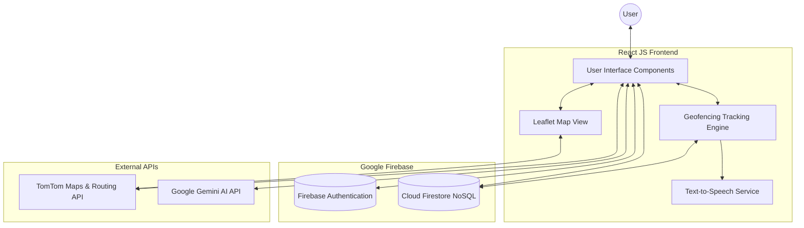
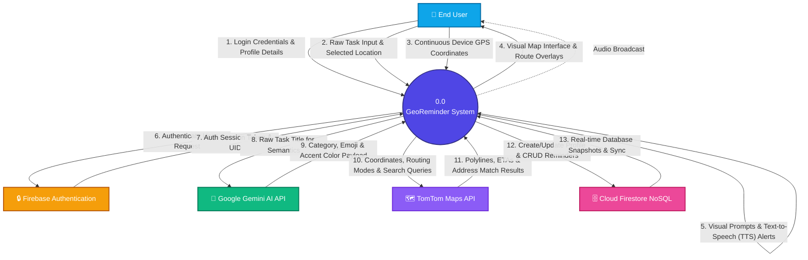
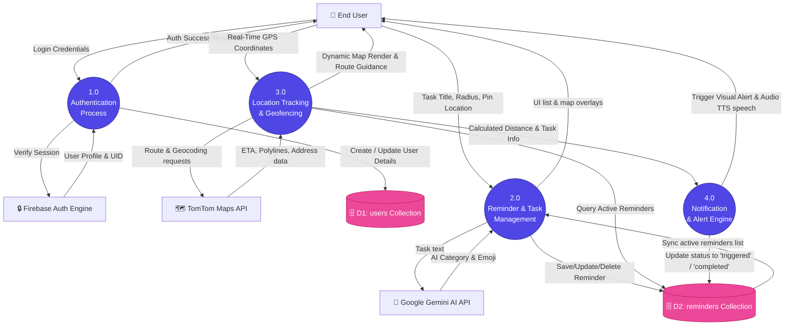
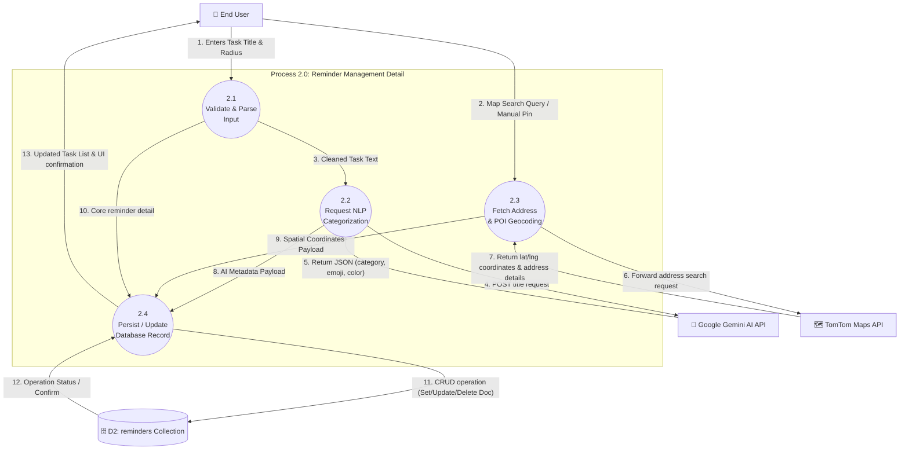
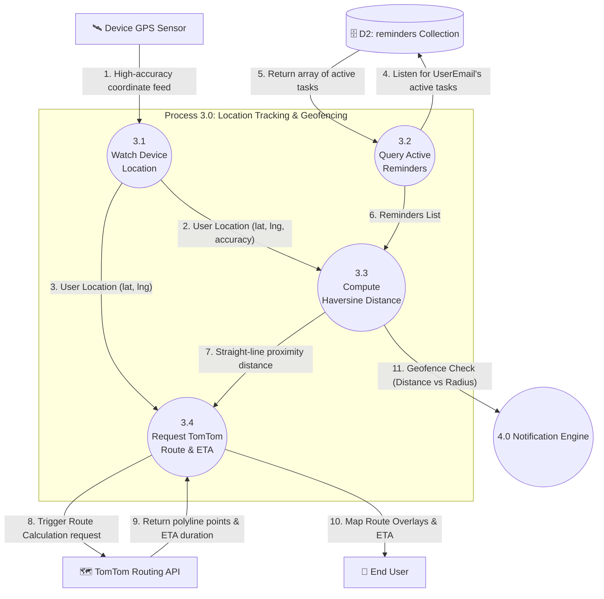
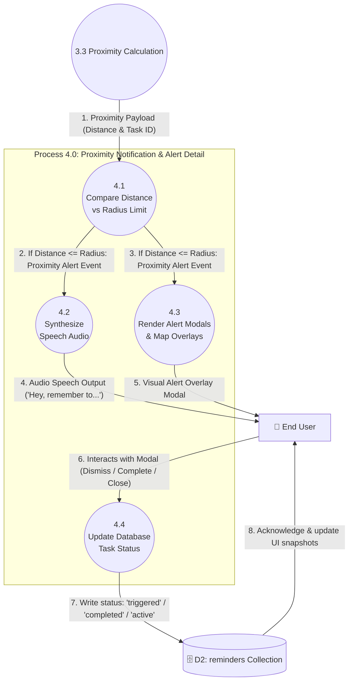
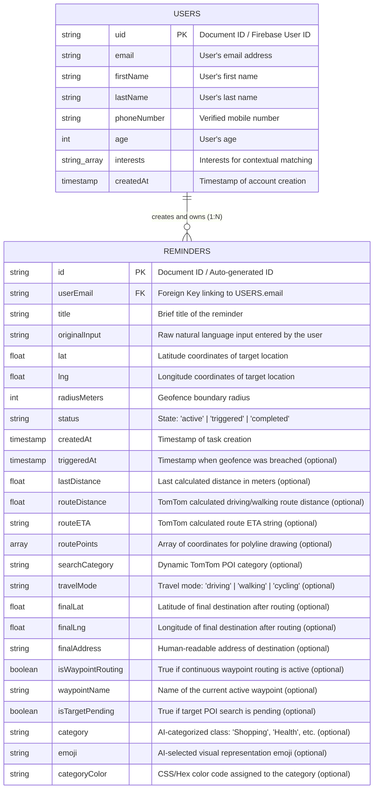

# CHAPTER 4: SYSTEM ARCHITECTURE AND DESIGN

## 4.1 System Architecture Principles
GeoReminder is built upon a **Serverless Client-Side Architecture**, leveraging a robust combination of modern frontend frameworks and managed cloud services. The guiding principles of this architecture are:
1.  **Separation of Concerns (MVC Adaptation)**: While React is primarily a UI library, the application adopts a pseudo-MVC pattern. The "Model" is managed remotely via Firebase Cloud Firestore, the "View" comprises React functional components (e.g., `MapView.tsx`, `LoginPage.tsx`, `AddReminderModal.tsx`), and the "Controller" logic is encapsulated within custom React Hooks and externalized service modules (`geminiService.ts`, `ttsService.ts`).
2.  **API-First Design**: The system relies heavily on external Application Programming Interfaces (APIs) to offload complex computational tasks. Natural language understanding is delegated to Google Gemini, while geospatial routing, address autocomplete, and reverse geocoding are handled by TomTom.
3.  **Real-Time Reactivity**: The architecture prioritizes live data synchronization. Using Firebase's `onSnapshot` listeners, the UI reacts instantaneously to database changes across multiple devices without requiring manual page reloads.
4.  **Stateless Tracking Engine**: The core geofencing loop operates continuously in the background, relying on pure mathematical functions (Haversine formula) to evaluate distance against an in-memory array of active tasks, ensuring minimal battery drain and high performance.

---

## 4.2 System Architecture Diagram
This diagram illustrates the high-level components of the system and how they interact to form the serverless ecosystem.

---

## 4.3 Data Flow Diagrams (DFD)

Data Flow Diagrams visually represent the movement of information within the GeoReminder system, mapping out inputs, outputs, processes, and data stores at progressive levels of detail.

### 4.3.1 Level 0 DFD (Context Diagram)
The Context Diagram defines the high-level boundary of the GeoReminder application, illustrating the interactions between the system as a single process and all external entities.

### 4.3.2 Level 1 DFD (Functional Decomposition)
The Level 1 DFD decomposes the system into four major functional sub-processes, mapping out the flow of data across the two main Firestore collections (D1: Users and D2: Reminders).

### 4.3.3 Level 2 DFDs
To capture the granular logic of the system, Level 2 DFDs are provided below for the core processes of Reminder Management, Location Tracking, and Notification Triggering.

#### A. Process 2.0 (Reminder & Task Management Detail)
This diagram breaks down the CRUD operations, NLP categorization via Gemini AI, and spatial geocoding via TomTom.

#### B. Process 3.0 (Location Tracking & Geofencing Detail)
This diagram details how the native browser Geolocation feed is listened to, how distance is calculated, and how routing data is updated dynamically from TomTom.

#### C. Process 4.0 (Notification & Alert Engine Detail)
This diagram details the exact flow from geofence breach detection, through audio/visual rendering, to final completion states.

### 4.3.4 Data Dictionary

The data dictionary below clarifies the structure and schema of the critical data flows between processes:

*   **Login Credentials**: `{ email, password }`
*   **User Profile Details**: `{ uid, email, firstName, lastName, phoneNumber, age, interests, createdAt }`
*   **Raw Task Input**: `{ title: String, radiusMeters: Number, lat: Number, lng: Number, travelMode: String }`
*   **AI Category Payload**: `{ category: ReminderCategory, emoji: String, categoryColor: String }`
*   **TomTom Routing Payload**: `{ routeDistance: Number, routeETA: String, routePoints: Array<[Number, Number]>, finalAddress: String }`
*   **User Location Feed**: `{ lat: Number, lng: Number, accuracy: Number, timestamp: Number }`
*   **Proximity Payload**: `{ distance: Number, radius: Number, isBreached: Boolean }`
*   **Alert Signal**: `{ voiceSynthesisString: String, modalDisplayActive: Boolean }`

---

## 4.4 Entity-Relationship (ER) Diagram

The ER Diagram details the NoSQL data structure and the relationship between the authenticated user and their specific tasks. Because Firebase Cloud Firestore is a NoSQL document database, this diagram represents a logical schema mapping flat parent-child associations via referencing.

### 4.4.1 NoSQL Relationship Model

### 4.4.2 Collection Schemas & Data Types

#### A. USERS Collection (`users`)
This collection stores user profile metadata. The Document ID matches the unique `uid` provided by Firebase Authentication upon registration.

| Field | Data Type | Key Type | Description | Required |
| :--- | :--- | :--- | :--- | :--- |
| `uid` | String | Primary Key | Unique user identifier generated by Firebase Auth | Yes |
| `email` | String | Unique Index | User's authenticated email address | Yes |
| `firstName` | String | - | User's first name | Yes |
| `lastName` | String | - | User's last name | Yes |
| `phoneNumber` | String | - | User's verified phone number | Yes |
| `age` | Number | - | User's age | Yes |
| `interests` | Array [String] | - | User's topics/interests for contextual NLP tasks | Yes |
| `createdAt` | Number (Epoch) | - | Account creation timestamp (in milliseconds) | Yes |

#### B. REMINDERS Collection (`reminders`)
This collection stores spatial tasks created by users. The Document ID is auto-generated by Firestore, and records are mapped back to users using `userEmail` as a soft foreign key.

| Field | Data Type | Key Type | Description | Required |
| :--- | :--- | :--- | :--- | :--- |
| `id` | String | Primary Key | Unique identifier generated by Firestore | Yes |
| `userEmail` | String | Foreign Key | Email address of the user who owns this reminder | Yes |
| `title` | String | - | Cleaned task title | Yes |
| `originalInput` | String | - | Raw text entered by the user in the prompt | Yes |
| `lat` | Number | - | Latitude coordinate of the geofenced location | Yes |
| `lng` | Number | - | Longitude coordinate of the geofenced location | Yes |
| `radiusMeters` | Number | - | Geofencing radius boundary in meters | Yes |
| `createdAt` | Number (Epoch) | - | Timestamp of reminder creation (in milliseconds) | Yes |
| `status` | String | - | Enum: `'active' \| 'triggered' \| 'completed'` | Yes |
| `triggeredAt`| Number (Epoch) | - | Timestamp of boundary breach (optional) | No |
| `lastDistance` | Number | - | Last recorded straight-line distance in meters | No |
| `routeDistance` | Number | - | Dynamic driving/walking/cycling distance from TomTom (meters) | No |
| `routeETA` | String | - | Human-readable route duration (e.g. "12 mins") | No |
| `routePoints` | Array [[Num, Num]] | - | Polyline coordinate pairs for drawing route on Leaflet Map | No |
| `searchCategory` | String | - | Dynamic Category ID (e.g. for searching nearest hospitals/banks) | No |
| `travelMode` | String | - | Enum: `'driving' \| 'walking' \| 'cycling'` | No |
| `finalLat` | Number | - | Latitude coordinates of computed route destination | No |
| `finalLng` | Number | - | Longitude coordinates of computed route destination | No |
| `finalAddress` | String | - | Full street address of target destination returned by TomTom | No |
| `isWaypointRouting`| Boolean | - | Continuous routing flag to check for dynamic updates | No |
| `waypointName` | String | - | Name of intermediate waypoint along route | No |
| `isTargetPending` | Boolean | - | Status flag for pending dynamic search | No |
| `category` | String | - | AI category assigned by Gemini (e.g. `'Shopping'`, `'Health'`) | No |
| `emoji` | String | - | Visually matching emoji assigned by Gemini | No |
| `categoryColor` | String | - | CSS styling color code based on the category | No |

---

## 4.5 Sequence Diagram: Task Creation and Trigger Flow
This sequence diagram maps out the chronological flow of events from the moment a user creates a reminder to the moment they physically arrive at the location and receive an alert.

