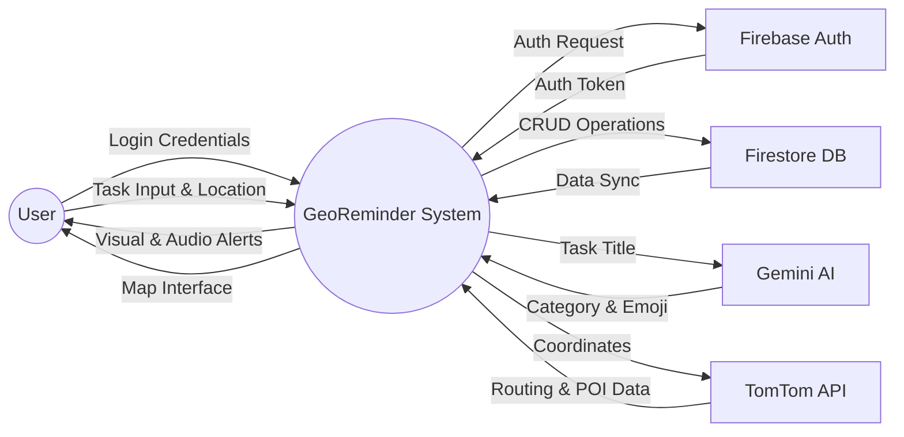
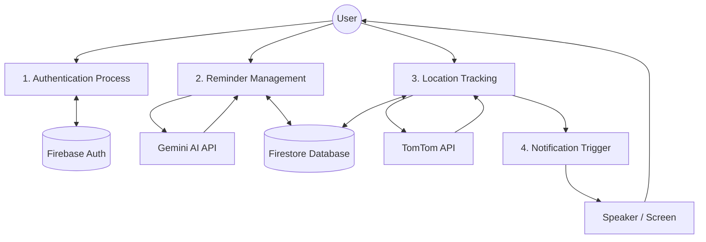
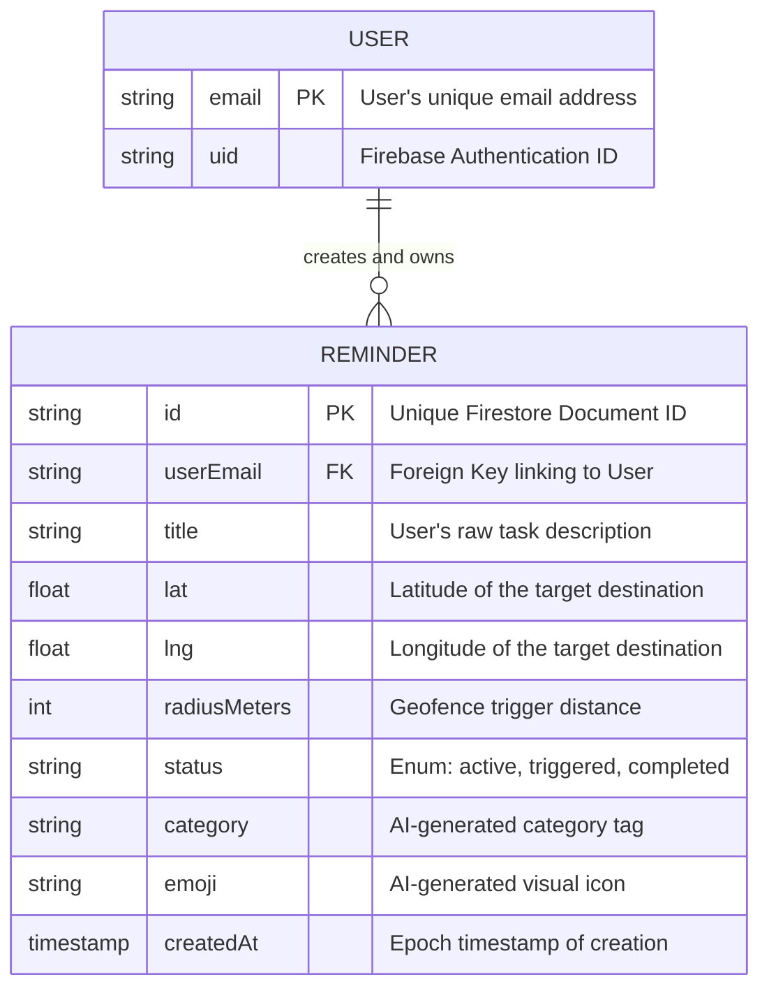
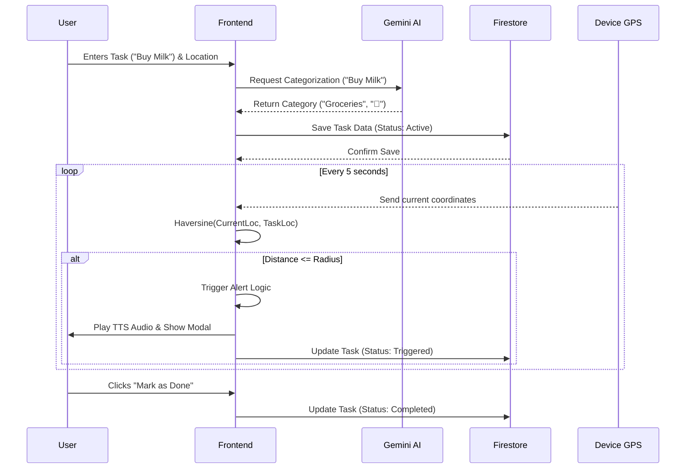

# CHAPTER 4: SYSTEM ARCHITECTURE AND DESIGN

## 4.1 System Architecture Principles
GeoReminder is built upon a **Serverless Client-Side Architecture**, leveraging a robust combination of modern frontend frameworks and managed cloud services. The guiding principles of this architecture are:
1.  **Separation of Concerns (MVC Adaptation)**: While React is primarily a UI library, the application adopts a pseudo-MVC pattern. The "Model" is managed remotely via Firebase Cloud Firestore, the "View" comprises React functional components (e.g., `MapView.tsx`, `LoginPage.tsx`), and the "Controller" logic is encapsulated within custom React Hooks and externalized service modules (`geminiService.ts`, `ttsService.ts`).
2.  **API-First Design**: The system relies heavily on external Application Programming Interfaces (APIs) to offload complex computational tasks. Natural language understanding is delegated to Google Gemini, while geospatial routing and geocoding are handled by TomTom.
3.  **Real-Time Reactivity**: The architecture prioritizes live data synchronization. Using Firebase's `onSnapshot` listeners, the UI reacts instantaneously to database changes across multiple devices without requiring manual page reloads.
4.  **Stateless Tracking Engine**: The core geofencing loop operates continuously in the background, relying on pure mathematical functions (Haversine formula) to evaluate distance against an in-memory array of active tasks, ensuring minimal battery drain and high performance.

---

## 4.2 System Architecture Diagram
This diagram illustrates the high-level components of the system and how they interact.

```mermaid
BRO PASTE KAR USMA YAAR 

graph TD
    subgraph Frontend Application [React JS Frontend]
        UI[User Interface Components]
        Map[Leaflet Map View]
        Engine[Geofencing Tracking Engine]
        TTS[Text-to-Speech Service]
    end

    subgraph Backend Services [Google Firebase]
        Auth[(Firebase Authentication)]
        DB[(Cloud Firestore NoSQL)]
    end

    subgraph External APIs
        TomTom[TomTom Maps & Routing API]
        Gemini[Google Gemini AI API]
    end

    User((User)) <--> UI
    UI <--> Map
    UI <--> Engine
    Engine --> TTS

    UI <--> Auth
    UI <--> DB
    Engine <--> DB

    UI <--> Gemini
    Map <--> TomTom
    UI <--> TomTom
``` 

MAIN

---

## 4.3 Data Flow Diagrams (DFD)

### 4.3.1 Level 0 DFD (Context Diagram)
The Context Diagram shows the GeoReminder system as a single process interacting with external entities.



### 4.3.2 Level 1 DFD
This diagram breaks the system down into its primary sub-processes.



---

## 4.4 Entity-Relationship (ER) Diagram
The ER Diagram details the NoSQL data structure and the relationship between the authenticated user and their specific tasks.



---

## 4.5 Sequence Diagram: Task Creation and Trigger Flow
This sequence diagram maps out the chronological flow of events from the moment a user creates a reminder to the moment they physically arrive at the location and receive an alert.


